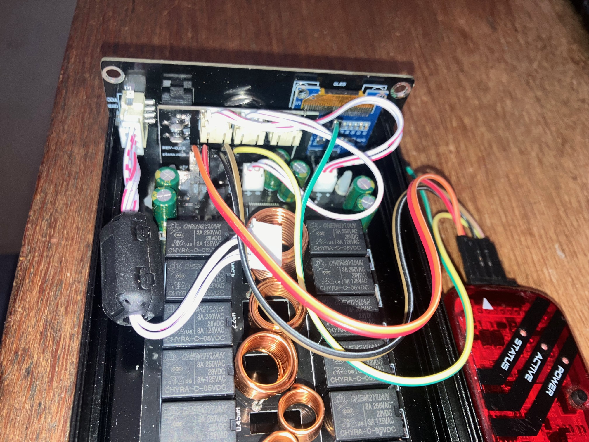

# Antenna tuner - ATU-100 EXT - Yet Another Firmware
A tweaked version of DG4SN's version of N7DCC's project.

I share all of DG4SN's given motivations for this project: particularly the ability to use an environment I understand. QRP has only a very loose definition, but I don't use power quite as low as Sven's. I use the tuner in the 10W to 50W bracket. Initially my core desire was to be able to switch on and off auto-tune without adding an exta button. Unfortunately, Sven has [stopped developing the firmware](https://github.com/DG4SN/ATU-100-EXT-YAF/issues/2#issuecomment-2628881203). What better opportunity for a play? There are a couple of places I felt it could use some improvement:

- My device is evidently slightly different, since when I flashed the DG4SN code, my display was upside-down. A menu item has been added to correct this.
- The auto cal wasn't working. Looking at the code, I believe that once the threshold is passed, that value is used as the calibration value, if it's stable. The definition of "stable" is that it's been the same for two sucessive iterations. This is thought to be insufficient. 
- I would like a power meter rather than just a flickery number.

Once I get the cal to work for higher forward power, I'll have a play with a power meter and maybe a rolling history of power or something fancy later.

In the meantime, here's a photo of my internals. I've seen at least three variations on how to istall this board. Note that I had to add the /MCLR pin. In order to flash I must disconnect the display. No big deal.



---

Tweaks by 2E0UMK as follows:
- Added a setup menu option to rotate the display.

To do:
- Fix the calibration so it works for higher power. Perhaps add fixed calibrations for certain max power level options, and leave the calibration as an advanced option.
- Add power / SWR gauges, which would be much more useful than flickery numbers.
- Add a screen saver, or a screen off timer. My OLED after 1 years is already affected by burn-in.
- Increase display font size of SWR and Power. Perhaps removing L and C displays.
- Option to scan first through the saved tunings before running a full tuning cycle. If we fnid a SWR lwess than (e.g. 1.4) just use that.

---
Environment: 

- I have the PICkit 3 hardware, and teh last IDE which supports this is MPLAB 6.2. So that's my environemnt.
- XC8 v3.00 compiler is used.
- Target MCU is 16F1938.

This code compiles in this environment and runs fine on my ATU-100.

---

The original project by N7DDC
https://github.com/Dfinitski/N7DDC-ATU-100-mini-and-extended-boards

Imported Notes
This firmware only works with the ATU-100_EXT (7x7) hardware, the PIC16F1938 MCU and the OLED Display 128x64px. Before you start please make a backup of the original firmware and be sure that you can restore it.

- You act at your own risk!
Features
Function menu on display – one button operation
10 memory slots for tune-settings one of them as a startup setting
Calibration function for the integrated power meter
Configurable Auto-Tune function
Sleep function for battery saving
Temporary Bypass function

---


## The reworked Microchip-IDE-Compatible project by DG4SN
https://github.com/DG4SN/ATU-100-EXT-YAF

## Motivation
After I have bought a Chinese clone of N7DDC Antenna tune ATU-100 EXT I wasn’t really satisfied.
The tuner was not able to work with my QRP transmitter. Also the shown power was very inaccurate.
I have seen some room for improvement in the firmware. Unfortunately the original firmware of N7DDC was written under the mikroC IDE that is not available for free. So I decided to start the project from scratch with the Microchip MPLAB X IDE.

## The original project by N7DDC
https://github.com/Dfinitski/N7DDC-ATU-100-mini-and-extended-boards

## Imported Notes
This firmware only works with the ATU-100_EXT (7x7) hardware, the PIC16F1938 MCU and the OLED Display 128x64px.
Before you start please make a backup of the original firmware and be sure that you can restore it.
```diff
- You act at your own risk!
```
## Features
+ Function menu on display – one button operation
+ 10 memory slots for tune-settings one of them as a startup setting
+ Calibration function for the integrated power meter
+ Configurable Auto-Tune function
+ Sleep function for battery saving
+ Temporary Bypass function 

## Button functions
**Button short pressed:** _____ *Start Tuning or select next item* 

**Button long pressed:** ______ *Enter Menu or change value* 

## Menu-tree
+ Bypass ______*Temporary bypass the current tune settings*
+ Load Tune __ *Load tune setting from memory slots*
+ Save Tune __ *Save the current tune settings in 10 memory slots*
+ Reset ______ *Reset the current tune settings*
+ Setup
     - Tuning _____ *Set tune parameters (Auto tune on/off)*
     * Sleep ______ *Set sleep mode and time*
     * Calibrate __ *Calibrate the power measurement at two points*
     * Test _______ *Test function for each relay*
+ About ______ *Who did it*

## Calibration
The firmware includes a two point calibration function for the integrated power meter.
It is recommend to calibrate on the lowest (max 10W) and highest (max 100W) used power level.
For calibration you need a transmitter with adjustable TX power and a dummy load.


## Programmer
For programming a PICkit3 programmer is used.
When the ATU-100 is switched off, connect it in the shown way.
After that switch on the ATU-100.


## Programming Tool
If you only like to flash the firmware you can use the Microchip Integrated Programming Environment
**MPLAB X IPE**.
The needed hex-file you find in the *dist* folder.


## Development IDE
For development the Microchip **MPLAB X IDE v6.00** was used.
The IDE is available for free on the Microchip web side.


